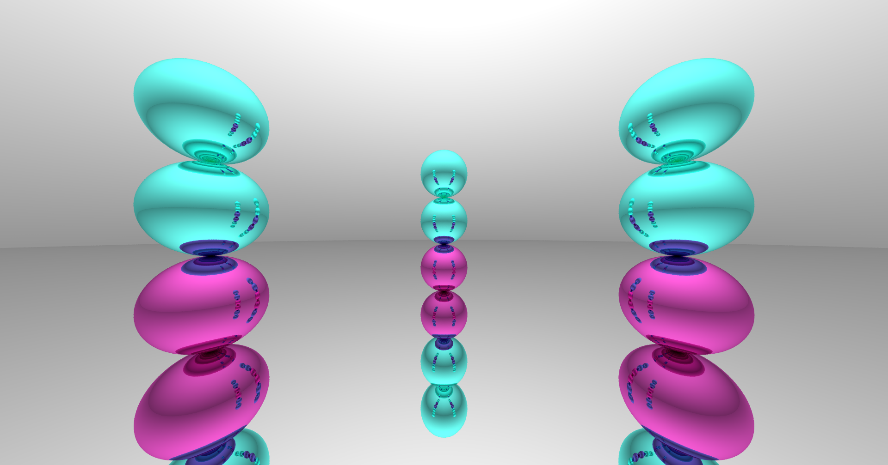
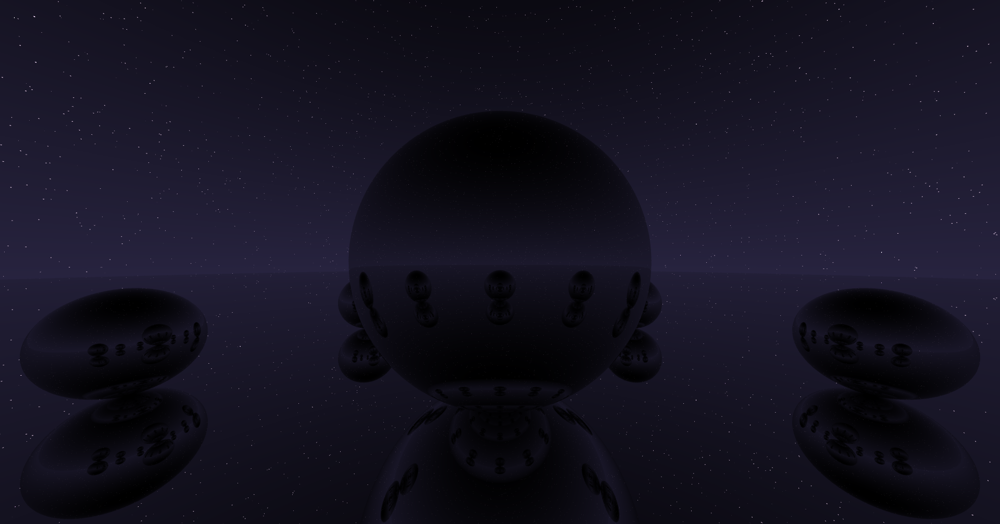

# Raytracer

This is a toy raytracer I made in Rust. I was inspired by [Raytracing in One Weekend](https://raytracing.github.io/books/RayTracingInOneWeekend.html) and thought it would be fun to follow along. 

Try the demo at [https://sberkun.github.io/raytracing/](https://sberkun.github.io/raytracing/)!

Here are some scenes from the raytracer:

