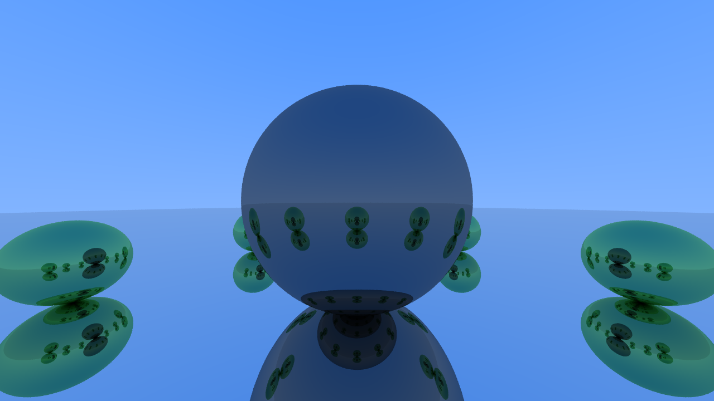

# Raytracer

This is a toy raytracer I made in Rust. I was inspired by [Raytracing in One Weekend](https://raytracing.github.io/books/RayTracingInOneWeekend.html) and thought it would be fun to follow along. 

Currently, my raytracer is good enough to make this wonderful scene:

 

